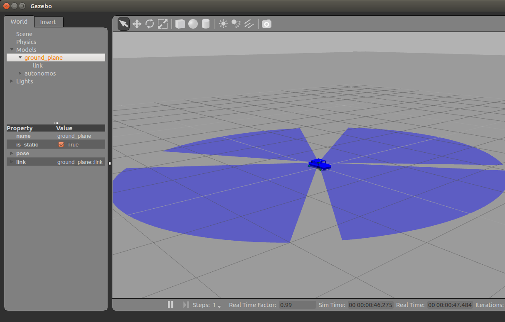

# AutoNOMOS Simulation Project

This project is looking to create a **simulation for** [AutoNOMOS mini](https://github.com/AutoModelCar/AutoModelCarWiki/wiki). With which one can be involved without requiring the actual car, and in case of requiring it with a *few steps* we can test our code on the real hardware.

## Setup Gazebo and ROS
Make sure you have ROS installed with Gazebo 2 (which is the default version). Full instalation instructions can be seen [here](http://wiki.ros.org/indigo/Installation/Ubuntu).
```
sudo apt-get install ros-indigo-desktop-full
```
This project has been tested with:
```
...
* /rosdistro: indigo
* /rosversion: 1.11.21
...
Gazebo multi-robot simulator, version 2.2.3
```
Before we can test the packages contained in this project, we should install the following packages to work with Gazebo and ROS (**Indigo** version, in case of requiring other version, [see here](https://github.com/ros-simulation/gazebo_ros_pkgs)):
```
sudo apt-get install ros-indigo-gazebo-ros-pkgs ros-indigo-gazebo-msgs ros-indigo-gazebo-plugins ros-indigo-gazebo-ros-control
```
Be sure to always source the appropriate ROS setup file, which for Indigo is done like so:
```
source /opt/ros/indigo/setup.bash
```
> You might want to add it to your `~/.bashrc`

And finally you can test the environment have been properly setup and built with a `rosrun` command:
```
roscore & rosrun gazebo_ros gazebo
```
This command should open Gazebo GUI with nothing inside. At viewing topics with `rostopic list`, we should see within the lists topics such as:
```
/gazebo/link_states
/gazebo/model_states
/gazebo/parameter_descriptions
/gazebo/parameter_updates
/gazebo/set_link_state
/gazebo/set_model_state
```
Additional help can be found [here](https://github.com/ros-simulation/gazebo_ros_pkgs)

## Setup project

Once we have our environment ready. We need to download or clone this project.
```
git clone https://github.com/EagleKnights/AutoNOMOS.git
```
Once we had the files in our computer, we need to build the workspace with `catkin build`. 

The last step is again to source the appropiate ROS setup file. Within our downloaded folder, execute `source devel/setup.bash`.

If we don't have `catkin` installed, execute `sudo apt-get install python-catkin-tools` ([see here](https://answers.ros.org/question/207433/catkin-build-gives-command-not-found/))

## Opening Gazebo GUI

With the previous steps completed. We can open a Gazebo window with the simulation car, using the following command.
```
roslaunch autonomos_gazebo_control autonomos_gazebo_control.launch
```
The Gazebo GUI should appear, now with the car in the center.


Now, we should see within the lists topics something like:
```
...
/app/camera/rgb/image_raw
/app/camera/rgb/image_raw/compressed
...
/autonomos/steer/steer_position_controller/command
/autonomos/steer/steer_position_controller/pid/parameter_descriptions
...
/cmd_vel
/gazebo/link_states
/gazebo/model_states
...
```

## Sending control actions to the car

The basic control of the car is described next.

### Steering:
To control the steering we need to send radians in a range from -0.5 to 0.5 to the steer joint, in a *std_msgs/Float64* message. This can be done with the following command:
```
rostopic pub -1 /autonomos/steer/steer_position_controller/command std_msgs/Float64 "data: -0.5"
```
### Velocity
In the case of velocity, we need to send values from 0.01 to 0.2 to the `/cmd_vel` topic, which receives a *geometry_msgs/Twist* data type, an example is the following:
```
rostopic pub -r 1 /cmd_vel geometry_msgs/Twist  '{linear:  {x: -0.02, y: 0.0, z: 0.0}, angular: {x: 0.0,y: 0.0,z: 0.0}}'
```

> Any improvements are welcome
